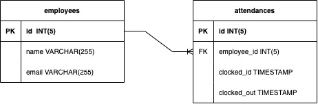
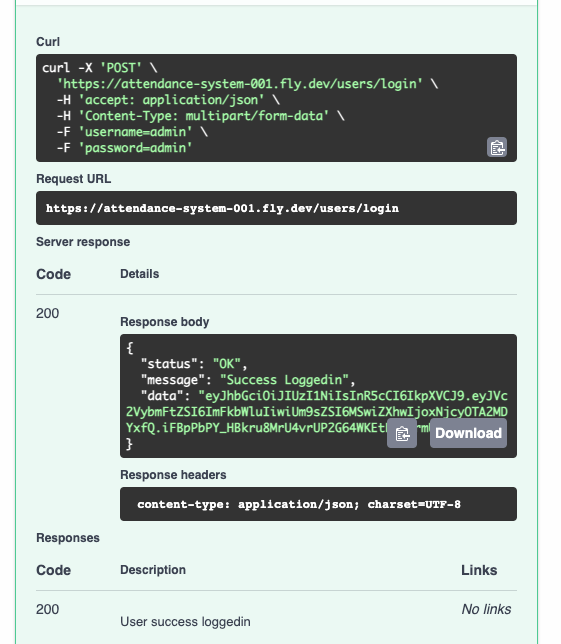
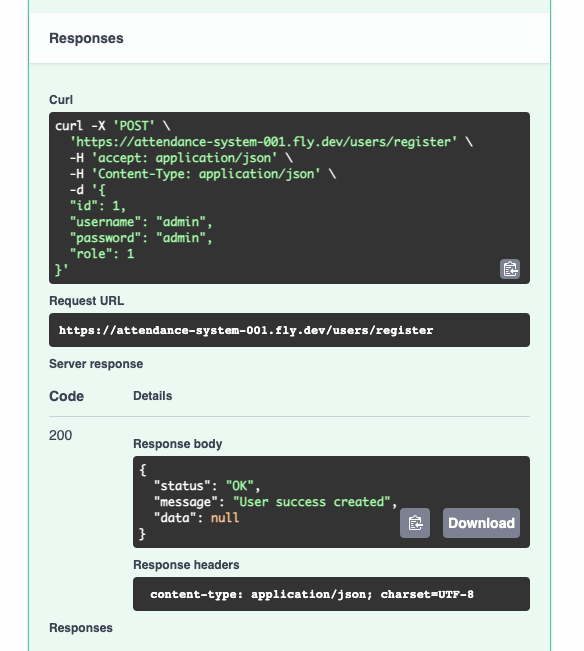
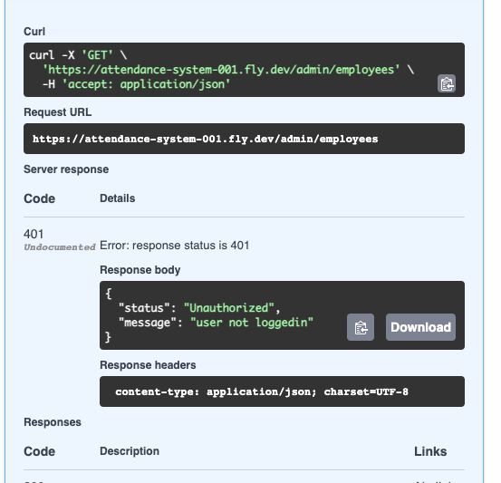
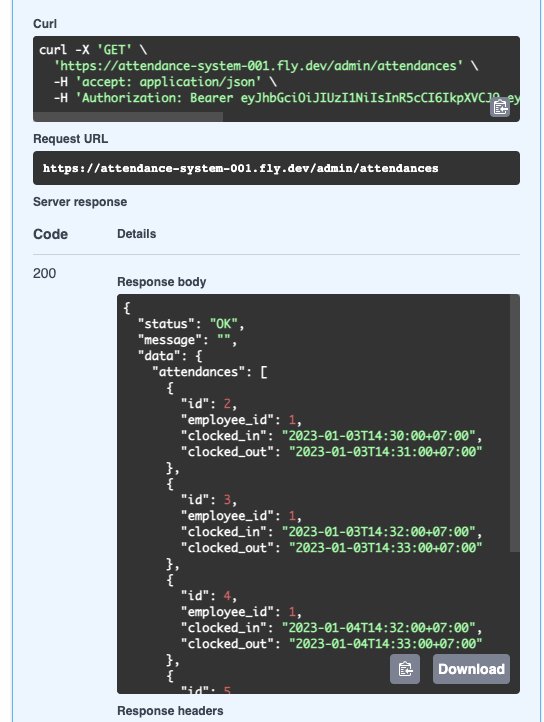
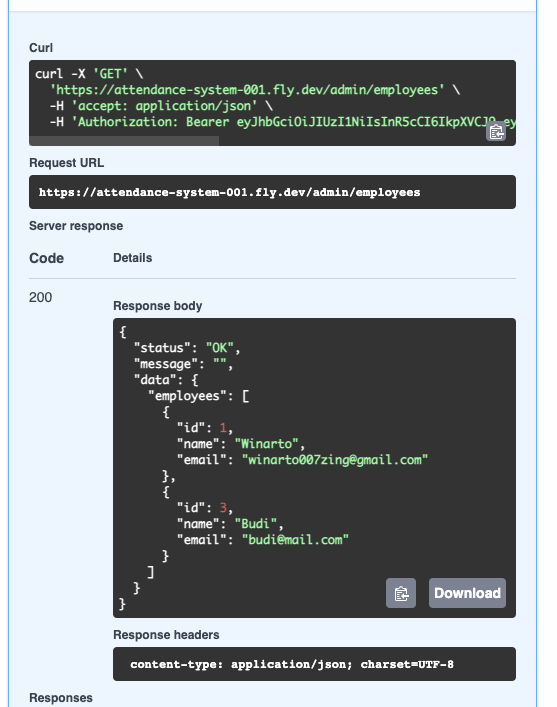

# Attendance System

## Descriptions
attendance application using the golang application with the clockin reminder and clockout reminder features. As the admin can add new users and take attendance, a clockin reminder will be sent to the user's email which must be clocked in and clocked out

## Requirements 
+ Go 1.19.4 or later
+ Mysql 8.0

## Used Framework 
+ echo (API Framework)
+ entgo (ORM)

## Feature 
- Authentication with bearer token using JWT
- CRUD Employee, Attendance
- Reminder using RabbitMQ as a message broker
- API Docs [swagger](./docs/api_docs.yaml)
- Implement CI
- deployed via fly.io 

## Database Schema
 
<br> <br>
### Table Employees
| Column | Data Type | Description |
|--------|-----------|-------------|
| id | INT(5) | unique id to identify employee |  
| name | VARCHAR(255) | employee name |  
| email | VARCHAR(255) | email of the employe. use for send reminder |   

<br> 

### Table Attendances
| Column | Data Type | Description |
|--------|--------------|----------|
| id | INT(5) | unique id to identify attndance |  
| employee_id | INT(5) | employee_id identify employee |  
| clcoked_in | TIMESTAMP | store date and time to reminder employee start working |   
| clcoked_out | TIMESTAMP | store date and time to reminder employee finished working |  

<br> 

### Table User
| Column | Data Type | Description |
|--------|--------------|----------|
| id | INT(5) | unique id to identify user |  
| username | INT(255) | username user |  
| password | TEXT | password user |   
| role | INT(1) | identify level of user use 1 to admin use 0 for basic user |  


## How to run this API 
1. Clone this repo 
  ```
    git clone https://github.com/winartodev/attendance-system.git
  ```
2. Open [swagger.yaml](./docs/swagger.yaml)
3. Enjoy it :)

## Here The Result

### Login Result

### Register Result 


### Authorization


### List Of Attendance 


### List Of Employee


### User un authorize
